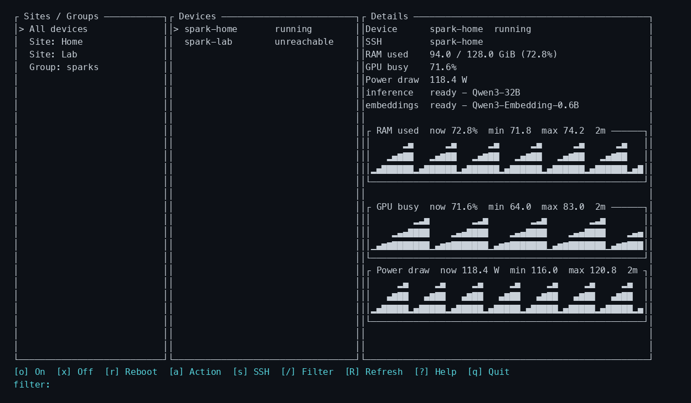

# Opilio

**Run and observe a small fleet of machines from one terminal.**

Opilio is a cross-platform Rust CLI and TUI for remote machines such as NVIDIA
DGX Spark systems. It uses the OpenSSH setup you already have, talks directly
to optional Shelly plugs or Wake-on-LAN, and installs nothing on managed
devices.



## What it does

| Capability | What you get |
|---|---|
| **Live fleet dashboard** | Sites, groups, device state, RAM used, GPU load, power draw, service health, model names, and in-memory history graphs. |
| **Safe power control** | Wake-on-LAN and Shelly on/off, graceful shutdown, reboot, and explicit forced power operations. |
| **Remote operations** | Interactive SSH plus named shell or structured-exec actions, with device and group overrides. |
| **LLM and service monitoring** | Generic command, health, and JSON-info probes; OpenAI-compatible model lists work with SGLang, LiteLLM, and similar services. |
| **Automation** | Stable JSON, meaningful exit codes, bounded concurrency, aliases, and native systemd/cron, launchd, or Task Scheduler jobs. |
| **Operational history** | Rotating, redacted JSONL records with bounded failure output. |
| **Portable setup** | Strict YAML plus safe import/export of flock configuration and only the required OpenSSH host entries. |

Opilio ships as one executable for macOS, Linux, and Windows. There is no
Opilio daemon, remote agent, database, container, or language runtime.

## Quick start

### 1. Build

Opilio requires Rust 1.85 or newer and a working system OpenSSH client.

```sh
git clone https://github.com/erikvullings/opilio.git
cd opilio
cargo build --release
```

The binary is written to `target/release/opilio` (`opilio.exe` on Windows).
Release archives are also produced for Linux x86-64, macOS Intel and Apple
silicon, and Windows x86-64.

### 2. Configure

Copy [`examples/config.yaml`](examples/config.yaml) to:

- Linux/macOS: `~/.config/opilio/config.yaml`
- Windows: `%APPDATA%\opilio\config.yaml`

A minimal SSH-only flock looks like this:

```yaml
sites:
  home:
    label: Home

devices:
  spark:
    site: home
    ssh: spark
    groups: [sparks]
    telemetry:
      provider: nvidia

groups:
  sparks:
    devices: [spark]
```

The `ssh` value is an ordinary OpenSSH host or alias. Keys, agents,
`ProxyJump`, host-key policy, and usernames continue to come from your SSH
configuration.

Secrets stay outside YAML:

```yaml
password: "${env:OPILIO_SHELLY_PASSWORD}"
```

```sh
export OPILIO_SHELLY_PASSWORD='...'
```

### 3. Check and run

```sh
opilio config check       # static validation; no network calls
opilio doctor all         # SSH, providers, telemetry, and services
opilio status all
opilio                    # open the TUI
```

Use arrow keys or `h/j/k/l` to navigate, `/` to filter, `R` to refresh,
`o`/`x`/`r` for lifecycle operations, `a` for named actions, `s` for an
OpenSSH handoff, and `?` for help.

## Everyday workflows

```sh
# Inspect
opilio status [device|group|site|all]
opilio doctor [device|group|site|all]

# Operate
opilio on <target> [--wait]
opilio off <target>
opilio reboot <target>
opilio action run <name> <target>
opilio ssh <device>

# Automate and audit
opilio status all --json
opilio schedule ls
opilio history [target]
opilio export setup.tar
```

Every operational/read command supports human-readable output; automation
surfaces provide versioned JSON and these exit codes:

| Code | Meaning |
|---:|---|
| `0` | Success |
| `1` | Operation failed |
| `2` | Configuration or usage error |
| `3` | Partial success |

## Safety model

Opilio keeps confirmation and force separate:

- A normal `off` requests graceful shutdown over SSH, waits until SSH becomes
  unreachable, and only then cuts Shelly power when configured.
- `--yes` suppresses collection confirmation; it never grants force.
- Physical `power-off`, `power-cycle`, and graceful-shutdown bypass require
  explicit `--force`.
- Disruptive collection operations run sequentially unless `--parallel N` is
  supplied.
- Scheduled operations are non-interactive but retain the same force rules.

Remote shutdown and reboot commands must be authorized non-interactively. If
they use `sudo`, configure narrowly scoped `NOPASSWD` rules for the exact
commands rather than granting broad passwordless sudo.

## How Opilio sees a device

A device can combine independent capabilities:

- **Reachability:** system OpenSSH.
- **Power:** Shelly, Wake-on-LAN, or neither.
- **Telemetry:** Linux system metrics and optional NVIDIA metrics.
- **Services:** remote status commands plus controller-side HTTP health and
  JSON-info endpoints.
- **Organization:** one site and any number of groups.

DGX Spark/GB10 unified memory is reported as system memory, not misleading
conventional VRAM. Service model extraction accepts strings and
OpenAI-compatible model arrays, so a LiteLLM endpoint can expose all advertised
models.

## Documentation

- [User guide](docs/USER_GUIDE.md) — installation, full configuration, safety,
  scheduling, migration, and troubleshooting.
- [v1 specification](docs/OPILIO_V1_SPEC.md) — product behavior and domain
  model.
- [Acceptance evidence](docs/V1_ACCEPTANCE.md) — release criteria mapped to
  automated tests.
- [Task index](TASKS/README.md) — resumable implementation history.

## Development

```sh
cargo test --all-targets --all-features
cargo clippy --all-targets --all-features -- -D warnings
cargo fmt --check
```

CI runs these checks on Linux, macOS, and Windows.

<details>
<summary>Implementation status — 20 / 20 tasks done</summary>

| Task | Status | Depends on | Outcome |
|---|---|---|---|
| [0001 Bootstrap Rust application](TASKS/0001-bootstrap-rust-application.md) | done | — | Buildable cross-platform CLI/library skeleton |
| [0002 Load and validate configuration](TASKS/0002-load-and-validate-configuration.md) | done | 0001 | Strict portable YAML + target model |
| [0003 Status and structured output](TASKS/0003-status-and-structured-output.md) | done | 0002 | `status`, target resolution, stable JSON/exit codes |
| [0004 OpenSSH execution layer](TASKS/0004-openssh-execution-layer.md) | done | 0002 | System SSH, commands/exec, multiplexing seam |
| [0005 Named actions and aliases](TASKS/0005-named-actions-and-aliases.md) | done | 0003, 0004 | Safe named remote actions + one-op aliases |
| [0006 Shelly power provider](TASKS/0006-shelly-power-provider.md) | done | 0003 | Local Shelly switching + electrical telemetry |
| [0007 Wake-on-LAN provider](TASKS/0007-wake-on-lan-provider.md) | done | 0003 | WoL power-on support |
| [0008 Safe lifecycle operations](TASKS/0008-safe-lifecycle-operations.md) | done | 0004, 0006, 0007 | on/off/reboot/power-cycle safety semantics |
| [0009 System and NVIDIA telemetry](TASKS/0009-system-and-nvidia-telemetry.md) | done | 0004 | CPU/RAM/GPU + DGX Spark UMA-aware telemetry |
| [0010 Generic service health](TASKS/0010-generic-service-health.md) | done | 0004 | Generic health/status/info incl. LLM model name |
| [0011 Operation history and logging](TASKS/0011-operation-history-and-logging.md) | done | 0005, 0008 | Rotating JSONL history + bounded failure output |
| [0012 Build the TUI dashboard](TASKS/0012-build-tui-dashboard.md) | done | 0008, 0009, 0010, 0011 | Keyboard-first live fleet dashboard |
| [0013 Diagnostics and doctor](TASKS/0013-diagnostics-and-doctor.md) | done | 0006, 0007, 0009, 0010 | Static config check + runtime diagnostics |
| [0014 Native scheduling adapters](TASKS/0014-native-scheduling-adapters.md) | done | 0005, 0011 | Linux/macOS/Windows schedule ls/add/rm |
| [0015 Portable export and import](TASKS/0015-portable-export-and-import.md) | done | 0002, 0004, 0013 | Safe setup migration + selective SSH config |
| [0016 Cross-platform hardening and release](TASKS/0016-cross-platform-hardening-release.md) | done | 0012, 0013, 0014, 0015 | v1 acceptance, docs, packaging, CI |
| [0017 Improve TUI observability](TASKS/0017-improve-tui-observability.md) | done | 0010, 0012 | Clear memory, multi-model services, useful telemetry history |
| [0018 Refine TUI details layout](TASKS/0018-refine-tui-details-layout.md) | done | 0017 | Aligned details, intentional spacing, conditional power |
| [0019 Diagnose lifecycle sudo failures](TASKS/0019-diagnose-lifecycle-sudo-failures.md) | done | 0008 | Actionable non-interactive sudo failures |
| [0020 Rewrite product README](TASKS/0020-rewrite-readme.md) | done | 0016, 0018 | Function-first landing page and TUI screenshot |

</details>
